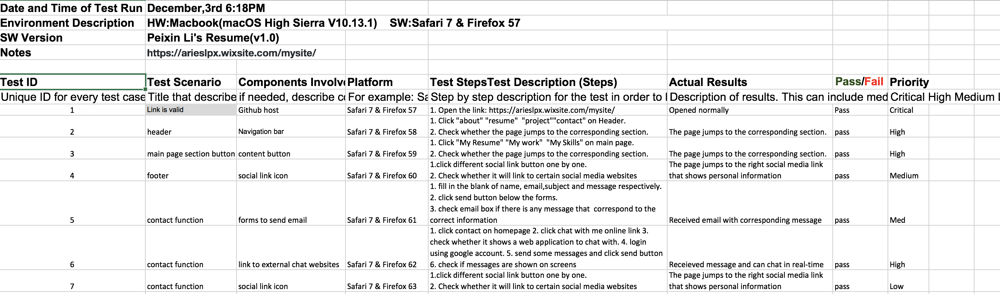

# EC601 HW2

## Task1:

For this task , I chose Bootstrap Web application. 

I created my own resume website using Bootstrap framework. What I have done is picking up a easy-to-start template, modifing it's style and color.Besides, I made screen scrollful and be able to be tracked by nevigate bar. In the end, released website through Github pages.

This is the link of website [MyResume](http://Irislpx.github.io)

## Task2:

For this task, I built a web application using Firebase platform and implement a real-time chatting function.Basically, Firebase is a paltform that can provide developer a SDK when develping a new project. In Firebase, it include console for developer to set database, storage, and other critical function blocks. Here is the specific introduction of firebase:  [Firebase](https://firebase.google.com).

What I have done is modify a web chat application on the codelabs that Firebase provided. I first forked project on [github](https://github.com/firebase/friendlychat-web), and followed instruction to create a web real-time chatting application, users would like to send messages and images at anytime they want after logging in.
[this is link of project](https://chatchat-a8a60.firebaseapp.com)

# UnitTest for HW2

## Task 1 - Test Cases

- Generate your own test cases.

- Run your own black box testing.

      In my resume, there are several functions implemented, such as chat, email, link to external social media link and so on. In order to test each functions is working perfectly well, I writed some test cases and run the black box testing based on them.

      Here is the screenshot of my test case :

## Task 2 - - Automated Test

- Run an automated test, e.g., AWS test farm and monkey test.

- Interpret the results.

      In this task, I used Monkey testing as a automated test to test my resume and chat web application.

